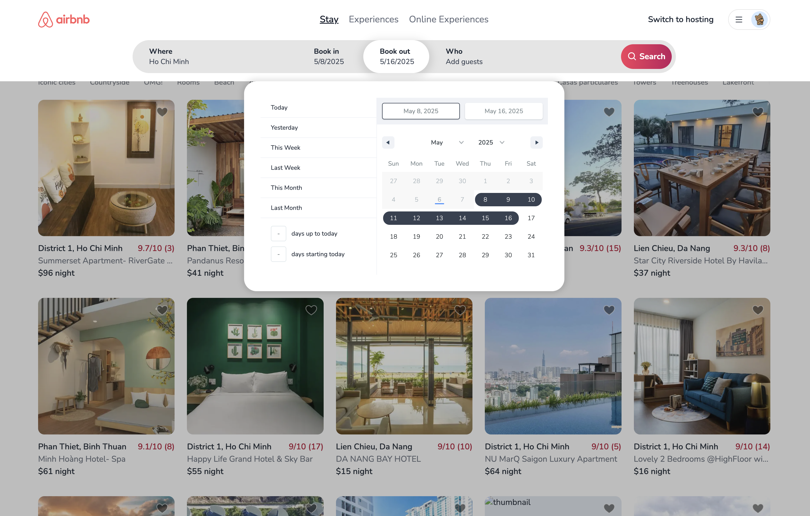
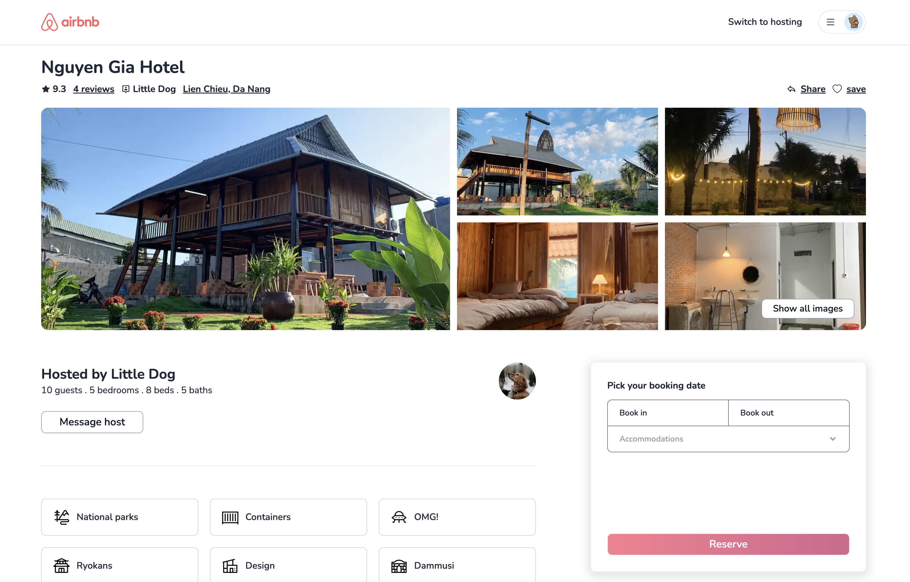
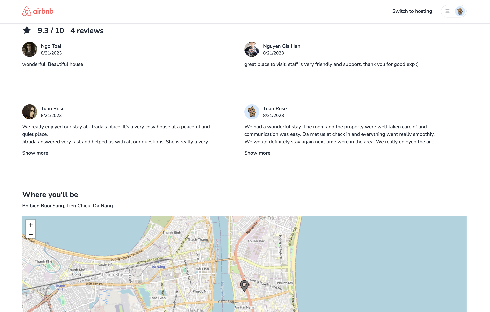
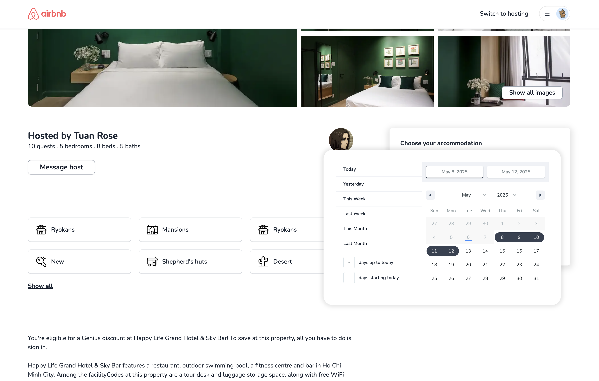
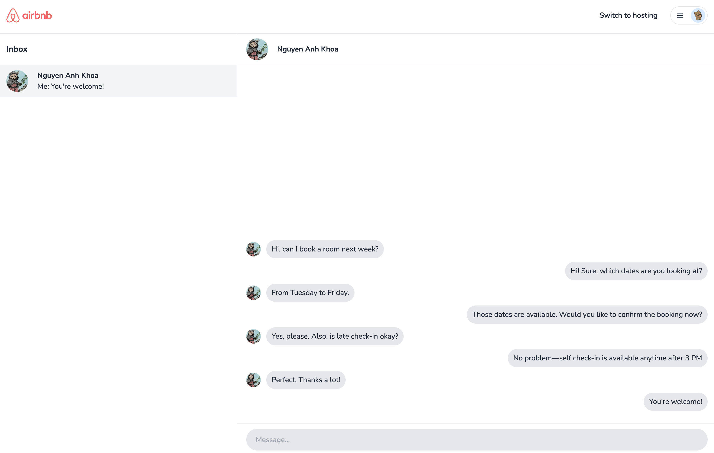

# Airbnb Clone FE

## About this project

This is the frontend of my Airbnb clone application, which implements the main features of Airbnb.com. People can search a airbnb or post their own room/house to the app. They can also use map for easily searching or message with the host

[BE repository](https://github.com/minhtri06/airbnb-be)

## Features

- Sign up, verify email
- Login with email/password, google login
- Refresh token asynchronously
- Update profile
- Change password
- Post property
- Book property
- Update property
- Manage property's booking
- Search properties by location and booking date
- Check property availability
- Save/un-save property
- Load review on scroll
- Message with host
- Schedule jobs

## Technologies

- Next.js
- Leaflet and React leaflet
- Zustand
- Socket.io client

## Screenshots

|  |  |  |
| ------------------------ | ------------------------ | ------------------------ |
|  |  |  |
